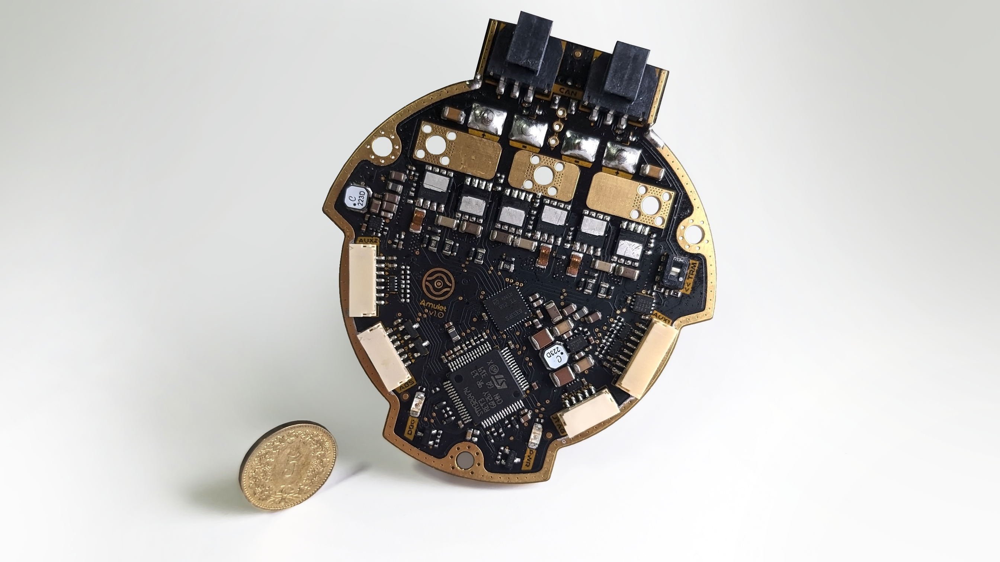

<p align="center" width="100%">
  <source media="(prefers-color-scheme: dark)" width="33%" srcset="./Logos/amulet_logo_light.svg">
  <source media="(prefers-color-scheme: light)" width="33%" srcset="./Logos/amulet_logo.svg">
  
</p>

<h1 align="center">Λ M U L E T</h1>

ΛMULET is a high-power brushless motor controller, compatible with the [moteus firmware](https://github.com/mjbots/moteus). It was specifically designed to be integrated in [EPFL Xplore](https://github.com/EPFLXplore)'s Legged Robot actuators.

<p align="center" width="100%">
    
</p>

***

## SPECIFICATIONS

| Parameter | ΛMULET V1.0 | 
| --- | --- |
| Voltage Input | 12-44V |
| Peak Electrical Power | TBD |
| Mass | TBD |
| Peak Phase Current | 100A |
| Communication | 5Mbps CAN-FD |
| Cooling | 12V Fan |
| Positioning | 2x Onboard 14-bit Encoders |
| Control rate | 15-30kHz |
| PWM Switching Rate | 15-60kHz |
| MCU | STM32G474 |
| Dimensions | 69.7 x 76.7mm |

***

## DIRECTORY STRUCTURE

```
amulet_controller
├── Computations     # Misc calculations
├── DXF_SVG          # Vector graphics
├── Images           # Pictures and screenshots
├── Logos            # Xplore and Amulet logos
├── Manufacturing
│   |── Assembly     # Position files, BOM, assembly document
|   |   └── ibom     # HTML BOM
|   └── Fabrication  # Fabrication document and testpoints positions
|       └── Gerbers  # Gerbers
├── STEP_Blender     # 3D STEP and pcb2blender file
├── Schematic        # PDF of schematic
├── Templates        # Title block templates
└── lib
    |── 3d_models    # Component 3D models
    |── lib_fp       # Footprint libraries
    └── lib_sym      # Symbol libraries
```

***

## FIRMWARE

[Associated firmware](https://github.com/EPFLXplore/XRE_moteus/tree/amulet) is forked from the [moteus](https://github.com/mjbots/moteus) repository.

***

## CREDITS

Schematic is hugely inspired by the moteus controllers designed by Josh Pieper. They were modified to meet our own specifications, and to follow what I personally consider good layout practices.

***

## PHOTOS

<p align="center" width="100%">
    
</p>

<p align="center" width="100%">
    
</p>

<p align="center" width="100%">
    
</p>

<p align="center" width="100%">
    
</p>
